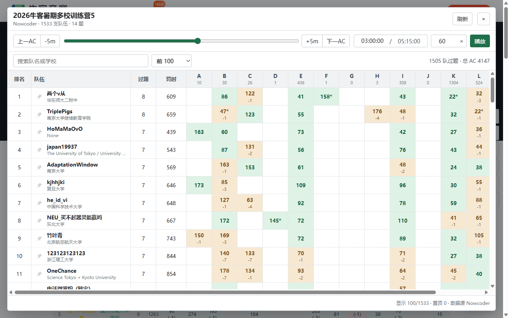

# ACM Contest Time Machine

一个用于回放 ACM 比赛历史榜单的用户脚本。目前支持牛客竞赛和 HDU Contest。



## 安装

1. 安装 [Tampermonkey](https://www.tampermonkey.net/) 或其他兼容的用户脚本管理器，并确认已启用用户脚本。
2. 选择任一来源安装脚本：
   - [从 Greasy Fork 安装](https://greasyfork.org/zh-CN/scripts/589686-acm-contest-time-machine)
   - [从 GitHub 安装](https://raw.githubusercontent.com/Haerbin23456/contest-time-machine/main/contest-time-machine.user.js)
3. 登录比赛平台，打开对应比赛的排行榜页面。
4. 点击页面右下角的“时光榜”。

用户脚本管理器会从对应的安装来源检查更新。

## 支持范围

- 牛客竞赛：比赛页面的排行榜标签页。
- HDU Contest：比赛的 Rank 页面，需要先登录该场比赛。

## 功能

- 拖动进度条或直接输入 `HH:MM:SS` 查看任意赛时的榜单。
- 跳到上一或下一个 AC 时刻，也可按 5 分钟移动。
- 按自定义倍速播放榜单变化。
- 搜索队伍、限制显示行数；首次打开时默认置顶自己的队伍，也可手动调整。
- 在窄屏和移动端使用固定排名、队伍列及响应式控制栏。

## 数据与限制

脚本读取当前比赛的终榜数据，并根据 AC 时间和错误次数重新计算指定时刻的过题数、罚时和排名。未通过且最终没有 AC 的提交不会影响 ACM 排名，但脚本无法知道这些提交具体发生在什么时候，也无法还原平台封榜期间曾向参赛者展示的状态。

这是非官方工具。比赛平台修改接口或页面结构后，脚本可能需要同步更新。

## 隐私

- 不读取或保存账号密码、Cookie、API Key。
- 仅向当前打开的牛客或 HDU 站点请求排行榜数据。
- 播放倍速和置顶队伍保存在对应站点的 `localStorage` 中。

## 开发

项目没有构建步骤，直接编辑 `contest-time-machine.user.js` 即可。提交前可执行：

```powershell
node --check .\contest-time-machine.user.js
```

## License

[MIT](LICENSE)
